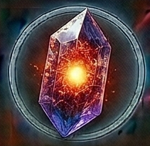

<!-- Auto-generated from crafting.db — do not edit manually -->

<table>
<tr><th colspan="2" style="text-align:center;"><h3>Stellar Heart</h3></th></tr>
<tr><td colspan="2" style="text-align:center;"></td></tr>
<tr><th colspan="2" style="text-align:center;">General</th></tr>
<tr><td><b>Category</b></td><td>artifact</td></tr>
<tr><td><b>Rarity</b></td><td>exotic</td></tr>
<tr><td><b>Size</b></td><td>3</td></tr>
<tr><td><b>Stackable</b></td><td>No</td></tr>
<tr><td><b>Tradeable</b></td><td>Yes</td></tr>
<tr><th colspan="2" style="text-align:center;">Market</th></tr>
<tr><td><b>Base Value</b></td><td>90,000 cr</td></tr>
</table>

> Crystallized core from an extinct star. Still warm.
