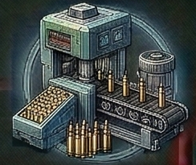

<!-- Auto-generated from crafting.db — do not edit manually -->

<table>
<tr><th colspan="2" style="text-align:center;"><h3>Ammo Fabricator</h3></th></tr>
<tr><td colspan="2" style="text-align:center;"></td></tr>
<tr><th colspan="2" style="text-align:center;">General</th></tr>
<tr><td><b>Category</b></td><td>component</td></tr>
<tr><td><b>Rarity</b></td><td>rare</td></tr>
<tr><td><b>Size</b></td><td>3</td></tr>
<tr><td><b>Stackable</b></td><td>Yes</td></tr>
<tr><td><b>Tradeable</b></td><td>Yes</td></tr>
<tr><th colspan="2" style="text-align:center;">Market</th></tr>
<tr><td><b>Base Value</b></td><td>700 cr</td></tr>
</table>

> Automated system for producing ammunition from raw materials.

## Crafting

### Produced By

| Recipe | Qty | Crafting Time | Skills Required |
|--------|-----|---------------|-----------------|
| Build Ammo Fabricator | 1 | 12 ticks | Engineering 2, Weapon Crafting 3 |

### Used In

| Recipe | Qty | Produces |
|--------|-----|----------|
| Build Crimson Ordnance Bay | 1 | [Crimson Ordnance Bay](../component/crimson_ordnance_bay.md) |
