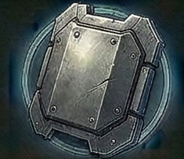

<!-- Auto-generated from crafting.db — do not edit manually -->

<table>
<tr><th colspan="2" style="text-align:center;"><h3>Armor Plate</h3></th></tr>
<tr><td colspan="2" style="text-align:center;"></td></tr>
<tr><th colspan="2" style="text-align:center;">General</th></tr>
<tr><td><b>Category</b></td><td>component</td></tr>
<tr><td><b>Rarity</b></td><td>uncommon</td></tr>
<tr><td><b>Size</b></td><td>2</td></tr>
<tr><td><b>Stackable</b></td><td>Yes</td></tr>
<tr><td><b>Tradeable</b></td><td>Yes</td></tr>
<tr><th colspan="2" style="text-align:center;">Market</th></tr>
<tr><td><b>Base Value</b></td><td>250 cr</td></tr>
</table>

> Reinforced hull plating for heavy armor construction.

## Crafting

### Produced By

| Recipe | Qty | Crafting Time | Skills Required |
|--------|-----|---------------|-----------------|
| Forge Armor Plate | 1 | 8 ticks | Advanced Crafting 2, Engineering 3 |

### Used In

| Recipe | Qty | Produces |
|--------|-----|----------|
| Build Capital Armor Plate | 10 | [Capital Armor Plate](../component/capital_armor_plate.md) |
| Forge Crimson Siege Plating | 2 | [Crimson Siege Plating](../component/crimson_siege_plating.md) |
| Forge Reinforced Bulkhead | 1 | [Reinforced Bulkhead](../component/reinforced_bulkhead.md) |
