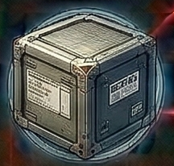

<!-- Auto-generated from crafting.db — do not edit manually -->

<table>
<tr><th colspan="2" style="text-align:center;"><h3>Cargo Container</h3></th></tr>
<tr><td colspan="2" style="text-align:center;"></td></tr>
<tr><th colspan="2" style="text-align:center;">General</th></tr>
<tr><td><b>Category</b></td><td>component</td></tr>
<tr><td><b>Rarity</b></td><td>common</td></tr>
<tr><td><b>Size</b></td><td>4</td></tr>
<tr><td><b>Stackable</b></td><td>Yes</td></tr>
<tr><td><b>Tradeable</b></td><td>Yes</td></tr>
<tr><th colspan="2" style="text-align:center;">Market</th></tr>
<tr><td><b>Base Value</b></td><td>300 cr</td></tr>
</table>

> Standardized storage module for general cargo.

## Crafting

### Produced By

| Recipe | Qty | Crafting Time | Skills Required |
|--------|-----|---------------|-----------------|
| Build Cargo Container | 1 | 5 ticks | Basic Crafting 2 |

### Used In

| Recipe | Qty | Produces |
|--------|-----|----------|
| Build Cargo Superstructure | 2 | [Cargo Superstructure](../component/cargo_superstructure.md) |
| Build Nebula Cargo Matrix | 2 | [Nebula Cargo Matrix](../component/nebula_cargo_matrix.md) |
