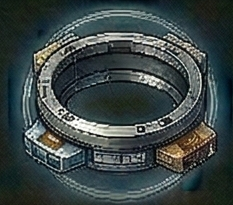

<!-- Auto-generated from crafting.db — do not edit manually -->

<table>
<tr><th colspan="2" style="text-align:center;"><h3>Docking Ring</h3></th></tr>
<tr><td colspan="2" style="text-align:center;"></td></tr>
<tr><th colspan="2" style="text-align:center;">General</th></tr>
<tr><td><b>Category</b></td><td>component</td></tr>
<tr><td><b>Rarity</b></td><td>rare</td></tr>
<tr><td><b>Size</b></td><td>8</td></tr>
<tr><td><b>Stackable</b></td><td>Yes</td></tr>
<tr><td><b>Tradeable</b></td><td>Yes</td></tr>
<tr><th colspan="2" style="text-align:center;">Market</th></tr>
<tr><td><b>Base Value</b></td><td>2,000 cr</td></tr>
</table>

> Universal docking collar for ship berthing.

## Crafting

### Produced By

| Recipe | Qty | Crafting Time | Skills Required |
|--------|-----|---------------|-----------------|
| Build Docking Ring | 1 | 40 ticks | Advanced Crafting 5, Station Management 4 |
