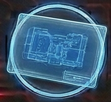

<!-- Auto-generated from crafting.db — do not edit manually -->

# data_chip

## Table of Contents
- [Blueprint](#blueprint)
- [Coordinate Chip](#coordinate-chip)
- [Data Chip](#data-chip)
- [Encrypted Data Core](#encrypted-data-core)
- [Star Map Fragment](#star-map-fragment)

---

## Blueprint

<table>
<tr><th colspan="2" style="text-align:center;"><h3>Blueprint</h3></th></tr>
<tr><td colspan="2" style="text-align:center;"></td></tr>
<tr><th colspan="2" style="text-align:center;">General</th></tr>
<tr><td><b>Rarity</b></td><td>rare</td></tr>
<tr><td><b>Size</b></td><td>1</td></tr>
<tr><td><b>Stackable</b></td><td>No</td></tr>
<tr><td><b>Tradeable</b></td><td>Yes</td></tr>
<tr><th colspan="2" style="text-align:center;">Market</th></tr>
<tr><td><b>Base Value</b></td><td>1,000 cr</td></tr>
</table>

> Technical schematics revealing a crafting recipe.

[View full page](blueprint.md)

---

## Coordinate Chip

<table>
<tr><th colspan="2" style="text-align:center;"><h3>Coordinate Chip</h3></th></tr>
<tr><td colspan="2" style="text-align:center;"></td></tr>
<tr><th colspan="2" style="text-align:center;">General</th></tr>
<tr><td><b>Rarity</b></td><td>uncommon</td></tr>
<tr><td><b>Size</b></td><td>1</td></tr>
<tr><td><b>Stackable</b></td><td>No</td></tr>
<tr><td><b>Tradeable</b></td><td>Yes</td></tr>
<tr><th colspan="2" style="text-align:center;">Market</th></tr>
<tr><td><b>Base Value</b></td><td>300 cr</td></tr>
</table>

> Contains coordinates to a specific location.

[View full page](coordinate_chip.md)

---

## Data Chip

<table>
<tr><th colspan="2" style="text-align:center;"><h3>Data Chip</h3></th></tr>
<tr><td colspan="2" style="text-align:center;"></td></tr>
<tr><th colspan="2" style="text-align:center;">General</th></tr>
<tr><td><b>Rarity</b></td><td>common</td></tr>
<tr><td><b>Size</b></td><td>1</td></tr>
<tr><td><b>Stackable</b></td><td>No</td></tr>
<tr><td><b>Tradeable</b></td><td>Yes</td></tr>
<tr><th colspan="2" style="text-align:center;">Market</th></tr>
<tr><td><b>Base Value</b></td><td>10 cr</td></tr>
</table>

> A writable data storage chip for notes and maps.

[View full page](data_chip.md)

---

## Encrypted Data Core

<table>
<tr><th colspan="2" style="text-align:center;"><h3>Encrypted Data Core</h3></th></tr>
<tr><td colspan="2" style="text-align:center;"></td></tr>
<tr><th colspan="2" style="text-align:center;">General</th></tr>
<tr><td><b>Rarity</b></td><td>exotic</td></tr>
<tr><td><b>Size</b></td><td>1</td></tr>
<tr><td><b>Stackable</b></td><td>No</td></tr>
<tr><td><b>Tradeable</b></td><td>Yes</td></tr>
<tr><th colspan="2" style="text-align:center;">Market</th></tr>
<tr><td><b>Base Value</b></td><td>2,000 cr</td></tr>
</table>

> Heavily encrypted data. Contents unknown.

[View full page](encrypted_data_core.md)

---

## Star Map Fragment

<table>
<tr><th colspan="2" style="text-align:center;"><h3>Star Map Fragment</h3></th></tr>
<tr><td colspan="2" style="text-align:center;"></td></tr>
<tr><th colspan="2" style="text-align:center;">General</th></tr>
<tr><td><b>Rarity</b></td><td>rare</td></tr>
<tr><td><b>Size</b></td><td>1</td></tr>
<tr><td><b>Stackable</b></td><td>No</td></tr>
<tr><td><b>Tradeable</b></td><td>Yes</td></tr>
<tr><th colspan="2" style="text-align:center;">Market</th></tr>
<tr><td><b>Base Value</b></td><td>500 cr</td></tr>
</table>

> Partial navigation data for unexplored regions.

[View full page](star_map_fragment.md)

---
